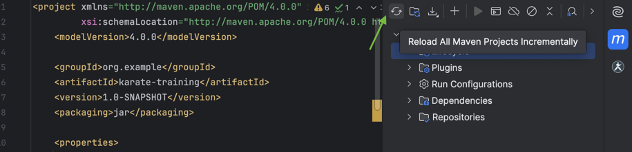
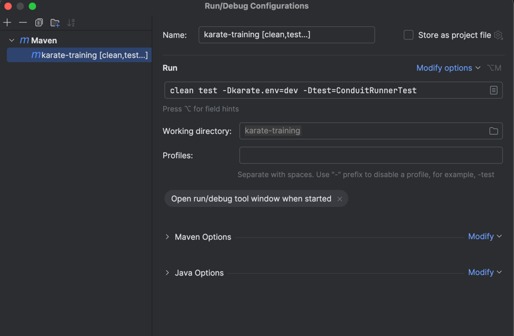
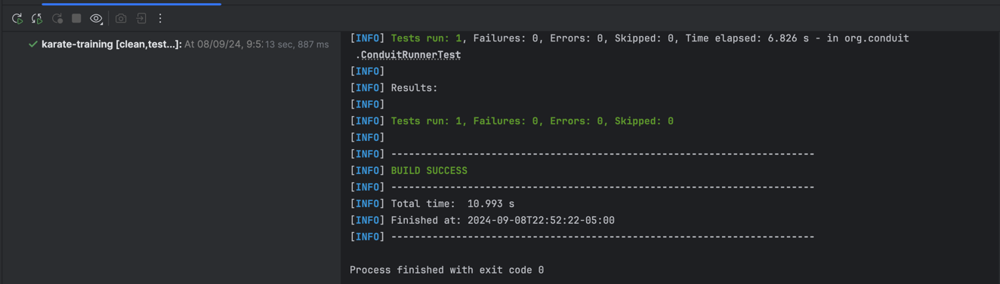

# 🚀 Karate Challenge 🚀

---

In this course you will be able to challenge your Karate knowledge. You will be able to configure the karate framework,
use different variables in the environments and practice cucumber/Jenkins by trying a real API.

<div>
  <a href="https://github.com/IrvinGalindo/karate-challenge/stargazers">
    
  </a>
   <a href="https://github.com/IrvinGalindo">
       
   </a>
   <a href="">
       
   </a>
</div>
<div>


</div>

## 🚧 Pre-requirements

---

### Install IntelliJ IDEA Community Edition

We recommend you to use IntelliJ as IDE, you can download it,
here:  [Get Started: JetBrains IntelliJ](https://www.jetbrains.com/es-es/idea/download/?section=mac)

### Install Java

Java version 11 or greater is required for Karate. You can get
one [here](https://www.oracle.com/java/technologies/downloads/) or if you already have it you can skip this bullet
point:

Note that [OpenJDK](https://jdk.java.net/) also works.

### Install Maven

IntelliJ includes Maven and installing Java would be easier, but you can install it if you want. Maven can be downloaded
from [here](https://maven.apache.org/download.cgi)

### Clone Project

Do not forget to clone the project to your local 😉

## 🔨 Setting up

---

1. After cloning, please load the project using maven
   

2. Create a new branch.

   >
   > **Format:** feature/[initialFirstNameInitialLastNameId]
   >
   > Example:
   >
   > **Name:** Irvin Galindo
   >
   > **Branch Name:** feature/IG12345678

3. Create a new maven configuration in IntelliJ
   

4. Run the program to validate setUp is OKAY ✅. Tests must pass.
   
   **NOTE:** you can also use mvn command in the IntelliJ terminal
   ``` mvn clean test -Dkarate.env=dev -Dtest=ConduitRunnerTest```

##  🎮 Challenge

---

Before getting on with it, It is important to mention that the API which will be used to practice Karate is provided
by [Bondar academy](https://www.bondaracademy.com/), and will only be used for educational purposes.

You can see the collection here.
[Postman Collection](https://www.postman.com/iromgalindo/conduit-api/environment/37903089-1f0e0317-22a7-42ec-95c7-a11ff8bbb916/conduit?action=share&creator=37903089)

>
>Note
>
> If you want to play with the API and run the calls manually, you can select the Conduit environment in Postman and use
> the following user that has already been created.
>
><table>
>  <tr> 
>    <th>
>     Email
>   </th>
>   <td>
>     TechMKarate@test.com
>   </td>
>  </tr>
>  <tr> 
>    <th>
>     Password
>   </th>
>   <td>
>     test123
>   </td>
>  </tr> 
> </table>


Now, your Karate Framework is ready, and you can start working on the challenges 🎉🎉🎉.

### To-Do List

<i>Below you will find a list of the challenges you must solve to complete this course, go for it. 💪 </i>

1. Ignore feature called [conduit.feature](src/test/java/org/conduit/features/conduit.feature). Do not delete it, just
   ignore it using **tags**.
2. Create attributes in config variable in [karate-config.js](src/test/karate-config.js).
    1. **baseUrl:**  it will contain the baseUrl.
    2. **token:** it will store a token given by a request.
    3. **email:** it will store an email provided by a feature test.
    4. **username:** This variable will contain two different values depending on the environment you use to run
       your tests. if karate.env=dev, then **[branchName]**-dev. if karate.env=prod, then **[branchName]-prod**.
    5. **slugs:** array which will store slug ids provided by a request.
3. Create new feature file called **register-user** under package [features](src/test/java/org/conduit/features) and
   test the following
   scenarios. [Register user](https://web.postman.co/workspace/My-Workspace~f79fdbc6-f622-45c7-8c45-63f99c4038e7/request/37903089-70cff9d5-77a2-4470-b630-678448de8359?tab=body).
    1. Create a method called **getRandomNumber**
       on [DataGenerator](src/test/java/org/conduit/helpers/DataGenerator.java) class which will return a random number.
    2. Add the generated number to the global **username** variable at the end.
    3. Using the username variable, create a new email **([newUsername@email.com])** and save it in the global variable called **email**
    4. **Scenario 1:** Register a valid user using the global variables **email**, and **username**.
        1. Validate the status code.
        2. Validate request returns user details.
        3. Store token in the variable called **token**.
    5. **Scenario 2:** Register an invalid user, missing username in request
       body. [Unexpected error request](https://web.postman.co/workspace/My-Workspace~f79fdbc6-f622-45c7-8c45-63f99c4038e7/example/37903089-3b355112-5256-44f9-b8bd-8120c3e78c25)
        1. Validate the status code.
        2. Validate request returns an error mentioning attribute is missed.
    6. **Scenario 3:** Register an existing
       user. [Existing user request](https://web.postman.co/workspace/My-Workspace~f79fdbc6-f622-45c7-8c45-63f99c4038e7/example/37903089-15447193-f8af-4ad0-9a2e-52946ecce339)
        1. Validate the status code.
        2. Validate request returns an error mentioning user already exists
4. Create new feature file called **tags** under package [features](src/test/java/org/conduit/features) and test the
   following
   request [Tags](https://web.postman.co/workspace/My-Workspace~f79fdbc6-f622-45c7-8c45-63f99c4038e7/request/37903089-0c32b370-46e7-4286-8aaa-4e930ed8e25f).
    1. **Scenario 1:** Get all tags.
        1. Validate the status code.
        2. Validate request returns an array which contains the tags **Coding**, and **Enroll**.
        3. Save the tags **Coding**, and **Enroll** in the global variable called **tags**.
5. Create new feature file called **create-articles** under package [features](src/test/java/org/conduit/features) and
   test the
   following
   request [Create Articles](https://web.postman.co/workspace/My-Workspace~f79fdbc6-f622-45c7-8c45-63f99c4038e7/request/37903089-bdcfed20-0a62-45e6-8433-e1883331e192).
    1. Create two article Json objects on [articles](src/test/java/org/conduit/data/articles.json) json file. **Example
       **
        ```
           {
   
             "article": {
              "title": "My test",
              "description": "this is a karate test",
              "body": "My first karate test",
              "tagList": [:tags]
             }
           }
        ```
    2. **Scenario 1:** Create new articles using json file
       called [articles](src/test/java/org/conduit/data/articles.json), stored tags and using the token as header.
        1. Validate the status code.
        2. Validate request returns article information you sent, ensure request contains an array which contains the
           tags **Coding**, and **Enroll**.
        3. Store the **slug** in the variable called **slugs**.
    3. **Scenario 2:** Create a new articles missing title attribute in request
       body [Unexpected error request](https://web.postman.co/workspace/My-Workspace~f79fdbc6-f622-45c7-8c45-63f99c4038e7/example/37903089-7095c4c1-9e59-4ba1-9b31-a61734b6cb88)
        1. Validate the status code.
        2. Validate request returns an error which mentions attribute is missed.
6. Create new feature file called **delete-articles** under package [features](src/test/java/org/conduit/features) and
   test the
   following
   request [Delete Articles](https://web.postman.co/workspace/My-Workspace~f79fdbc6-f622-45c7-8c45-63f99c4038e7/request/37903089-44ba4cdf-3633-4731-b85a-7ebb7a9bfd5b).
    1. **Scenario 1:** Delete the first article using the first slug in **slugs** variable.
        1. Validate the status code.
        2. Remove deleted slug from **slugs** variable
7. Run program using **dev** environment, validate test pass, and save the report that is
   in [cucumber](target/cucumber-html-reports/overview-features.html)

   ``` mvn clean test -Dkarate.env=dev -Dtest=ConduitRunnerTest```
8. Run program using **prod** environment, validate test pass, and save the report that is
   in [cucumber](target/cucumber-html-reports/overview-features.html)

   ``` mvn clean test -Dkarate.env=prod -Dtest=ConduitRunnerTest```
9. Create a PR named as your branch name.

## 🎊🎊 That's it, you finished karate's Challenge. Congratulations!!! 🎊🎊

